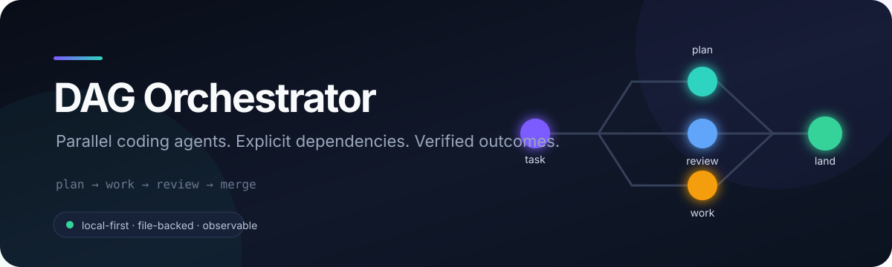
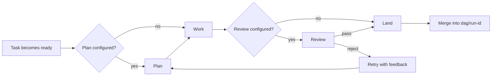

<p align="center">
  
</p>

<p align="center">
  <a href="https://github.com/JoeFresco1/DAG_orchestrator/actions/workflows/test.yml"></a>
  
  
  <a href="LICENSE"></a>
</p>

<p align="center">
  Turn a coding plan into a dependency graph, run independent work in parallel,<br />
  and make every task earn its way into the integration branch.
</p>

---

DAG Orchestrator is a local-first runner for coding agents. Give it small,
verifiable tasks; it handles dependency order, parallelism, retries, isolated
git worktrees, reviewer verdicts, and a live browser view.

There is no database, hosted control plane, or always-on daemon. A run is a
plain JSON file in your repository, with logs and state beside it.

## Why use it?

| | Capability | What it gives you |
|---|---|---|
| ⚡ | **Dependency-aware parallelism** | Independent tasks run together; dependent tasks wait for real prerequisites. |
| 🌿 | **One worktree per task** | Agents edit in isolation and successful work lands on a dedicated integration branch. |
| ✅ | **Verification that gates progress** | Commands or reviewer agents must pass before a task completes. Missing verdicts fail closed. |
| 🔁 | **Retries, repair, and fallback** | Retry failed subtrees, repair upstream work, or hand an attempt to another agent CLI. |
| 🔍 | **Review after the build** | Audit a completed DAG or an existing repository, read verified findings, then decide whether to run repairs. |
| 👁️ | **A live local viewer** | Watch the graph, queue, logs, attempts, plans, and verdicts from one browser tab. |
| 📁 | **Portable state** | The graph, history, transcripts, and archived runs live with the project—not in a black box. |

## The 60-second tour

### 1. Install

You need **Node.js 20+**, **Git**, and at least one non-interactive agent CLI
such as Codex, Claude Code, OpenCode, Cursor, or Gemini.

```bash
git clone https://github.com/JoeFresco1/DAG_orchestrator.git
cd DAG_orchestrator
pnpm install
pnpm build
npm link
```

`npm link` makes the `dag` command available globally. You can instead run
`node dist/cli.js <command>` from this repository.

### 2. Describe the graph

Run these commands inside the project you want the agents to work on:

```bash
dag init --objective "Ship the import pipeline"
dag settings --worktree task --concurrency 3

dag add \
  --title "Parse input records" \
  --spec "Inputs: docs/format.md. Outputs: src/parser.ts and tests. Acceptance: pnpm test parser."

dag add \
  --title "Expose the import API" \
  --spec "Use the parser to implement the import endpoint. Acceptance: pnpm test api." \
  --deps task_ab12cd34  # replace with the ID printed by the first `dag add`
```

Tasks without a command are manual. Point them at an installed agent harness
to make the run automatic:

```bash
dag harness list
dag set --all --harness codex --with-review
```

Swap `codex` for `opencode`, `claude`, `cursor-agent`, or `gemini`. The harness
supplies the non-interactive work, planning, and—when requested—review commands.

### 3. Run and watch

```bash
dag serve --open          # interactive: press Run in the viewer
# or
dag run --concurrency 3   # headless
```

`dag run` exits non-zero when work fails or the graph does not converge, so it
fits naturally into scripts and CI.

## The execution model



Every task moves through `plan → work → review → land`:

- **Plan** is optional, but binding. If planning fails, work never starts.
- **Work** can be any non-interactive command—not only an AI agent.
- **Review** can be a test command or an agent that emits `VERDICT: PASS` or
  `VERDICT: FAIL: reason`.
- **Land** commits and merges only verified work into `dag/<runId>` when
  worktree isolation is enabled. Your current checkout remains untouched.

The runner refills concurrency slots as soon as tasks finish. Downstream work
starts only after its dependencies have completed and landed.

## Built for agent work that can be trusted

### Isolated worktrees

```bash
dag settings --worktree task --concurrency 4
dag run
```

Each task receives its own git worktree. DAG Orchestrator snapshots the current
working tree—including uncommitted and untracked files—as the baseline, so
agents see your real starting point without editing your checkout.

Successful tasks merge into `dag/<runId>`. Failed or stopped tasks keep their
recoverable work on a `dag-task/...` branch. Merge conflicts trigger a bounded
redo on the new base instead of silently combining incompatible edits.

> [!NOTE]
> Worktrees do not contain ignored dependencies such as `node_modules` or
> `.venv`. Configure preparation when tasks need them:
> `dag settings --worktree-prepare "pnpm install --frozen-lockfile"`.

### Reviewer gates

Attach a deterministic check or an agent reviewer to any task:

```bash
dag reviewer add \
  --id task_ab12cd34 \
  --name regression \
  --cmd "pnpm test" \
  --verdict exit-code

dag reviewer add \
  --id task_ab12cd34 \
  --name contract \
  --cmd "codex exec 'Inspect the implementation and tests. End with VERDICT: PASS or VERDICT: FAIL: reason'" \
  --when "diff-lines>250"
```

Multiple reviewers can guard the same task. Conditional reviewers support
`always`, `on-reject`, `diff-lines>N`, and `diff-touches:glob,glob`.

Agent reviewers must end their output with one of these markers:

```text
VERDICT: PASS
VERDICT: FAIL: tests still assert the old record shape
```

No readable verdict means no approval.

### Fallback across agent CLIs

An ordered harness chain can hand later attempts to another tool:

```bash
dag set --all \
  --harness-chain "opencode:provider/model:xhigh,codex,claude:sonnet"
```

The first attempt uses OpenCode, the second Codex, and the third Claude. Each
candidate owns its model identifier and command shape; the run records which
harness produced each attempt.

### Repair and recovery

```bash
dag retry --id task_ab12cd34 --cascade  # retry a failure and its affected subtree
dag retry-failed --cascade          # retry every failed branch
dag resume                          # requeue work interrupted by a crash
dag kill-orphans                    # reap processes left by a dead runner
dag skip-blocked                    # deliberately converge past blocked work
```

Failures keep their kind (`exit`, `spawn`, `timeout`, `stalled`, `review`,
`merge`, `plan`, and more), exit code, and output tail. Recovery does not
require hand-editing state.

## Reviews that understand the graph

### Integration tasks

Create a node that checks whether several completed tasks actually fit
together:

```bash
dag review \
  --of task_api,task_client \
  --title "API and client agree" \
  --cmd "pnpm test integration" \
  --repair-rounds 1
```

If the integration check fails, DAG Orchestrator can requeue the upstream work
and then rerun the integration node.

### Chain reviews

Review a wave, a dependency cone, or an entire large run as normal DAG nodes:

```bash
dag layers
dag chain-review --wave 3 --batch 10
dag chain-review --from task_9f2 --depth 2
dag chain-review --all --batch 25
```

Before each chain review starts, the runner creates a manifest and one diff per
covered task in `dag.run.d/reviews/chain-<taskId>/`. Reviewers work from actual
results, verdicts, commits, and diffs—not from task descriptions alone.

### End-of-run review

```bash
dag settings --final-review per-task --final-review-rounds 1
dag final-review --mode per-task
```

Per-task final review uses attributable worktree diffs. A rejection with rounds
remaining requeues the task with the reviewer’s feedback. Without worktree
isolation, DAG Orchestrator falls back to a run-level advisory review.

## Closed-loop software factory

The factory uses the same DAG executor for checks, code review, independent
finding verification, repair, and certification. Choose an entry point:

| Starting point | Command | What happens |
|---|---|---|
| A structured goal to implement | `dag factory start --goal goal.json --file dag.factory.json` | Runs implementation and the full factory cycle. |
| A completed ordinary DAG | `dag factory review --source-run dag.run.json --file dag.review.json` | Reads the prior run as context and reviews current code in a separate run. |
| An existing TypeScript repository | `dag factory review --file dag.review.json` | Builds a narrow review goal from the repository; no goal JSON is needed. |

The review command never reruns implementation tasks from a supplied goal or
prior DAG. Add `--goal goal.json` when you want its requirements and coverage
policy to guide the review. With no `--goal`, it indexes files from
`tsconfig.json`, uses the Codex harness, and selects an npm `test`,
`typecheck`, or `build` script as its
deterministic check. Pass `--check "command"` if none exists; use `--harness`,
`--cmd`, or `--code-units src/a.ts,src/b.ts` to override the reviewer or scope.
The generated goal covers its configured check and records **zero product risk
coverage**. Supply a structured goal when you need broader requirement and
risk coverage.

Every review produces an evidence-backed report:

```bash
dag factory status --file dag.review.json
dag factory report --file dag.review.json       # add --json for the full record
```

If defects are verified, the review **pauses before creating repair tasks**.
Choose whether to proceed:

```bash
dag factory fix --file dag.review.json          # create and run the repair DAG
# or
dag factory close --file dag.review.json        # finish with findings unresolved
```

`dag factory resume --file dag.review.json` restores interrupted work but does
not choose repairs for you. A clean review continues to certification. A
closed review records its findings without claiming they were fixed. Reports
are tied to the source commit; changes to the code require a new review.

For a build goal, use `dag factory status --file dag.factory.json` and
`dag factory resume --file dag.factory.json` to inspect or continue the cycle.
Build-mode completion requires a convergence policy and measured assessment;
the [operator guide](docs/software-factory.md) shows the evidence format.

The controller stores versioned graph artifacts and its resume checkpoint in
the run sidecar. See the [software factory operator guide](docs/software-factory.md)
for the goal schema, command contracts, and recovery procedure.

## One host, many projects

One hub can serve every registered project:

```bash
dag serve --open
dag projects list
dag projects open my-project
```

The viewer has three scopes:

```text
/                 projects on this host
/p/<projectId>    active and archived runs for one project
/r/<runId>        graph, queue, inspector, logs, and live task terminals
```

Runs execute independently, each with its own file, lock, runner, and
integration branch. Archived runs are read-only.

For one-server-per-project operation with stable ports:

```bash
dag launch --all --open
dag servers
dag servers --stop --all
```

## Scheduling

Queue runs across repositories, including explicit order and start times:

```bash
dag schedule add --file ../api/dag.run.json --name api
dag schedule add --file ../web/dag.run.json --name web --after api
dag schedule add --file ../e2e/dag.run.json --name e2e --after web --at "2026-09-18 23:00"
dag scheduler --watch --open
```

If a scheduled predecessor fails, its dependents are marked blocked rather
than started against incomplete work.

## What lives on disk?

```text
dag.run.json                 graph, task specs, commands, and policies
dag.run.d/state.json         statuses, attempts, results, and verdicts
dag.run.d/events.jsonl       append-only event history
dag.run.d/logs/              per-attempt stdout and stderr
dag.run.d/plans/             planner output
dag.run.d/deps/              upstream evidence supplied to workers
dag.run.d/reviews/           task and chain-review diffs
dag.review.d/factory/        review report, evidence, graphs, and checkpoint
dag.runs/<runId>/            archived runs
```

Files are written atomically and the active run is protected by a
stale-detecting PID lock. Different projects use different files and can run
at the same time.

## Command map

| Job | Commands |
|---|---|
| Build the graph | `init`, `add`, `edit`, `rm`, `set`, `gate` |
| Inspect it | `list`, `status`, `ready`, `blocked`, `show`, `layers`, `dot` |
| Execute it | `run`, `approve`, `reject`, `heartbeat` |
| Recover | `retry`, `retry-failed`, `resume`, `kill-orphans`, `skip-blocked`, `gc` |
| Verify | `review`, `reviewer`, `chain-review`, `final-review` |
| Run a factory cycle | `factory start`, `factory review`, `factory report`, `factory fix`, `factory close` |
| Choose workers | `harness`, `models`, `set --harness`, `set --harness-chain` |
| Browse runs | `serve`, `launch`, `projects`, `runs`, `servers` |
| Schedule | `schedule`, `scheduler` |

Run `dag` for the complete help text. Add `--json` to commands you want to
consume programmatically.

<details>
<summary><strong>Command template tokens</strong></summary>

| Token | Value |
|---|---|
| `{id}` `{title}` `{spec}` | The current task’s identity and instructions |
| `{plan}` `{planFile}` | Planner output inline or as an absolute file path |
| `{deps}` | Results, verdicts, branches, and commits from direct dependencies |
| `{depsAll}` `{depsFile}` | The same evidence for all transitive dependencies |
| `{lastRejection}` | Feedback from the previous rejected attempt |
| `{model}` `{variant}` | Effective per-task or run-wide model settings |
| `{diffFile}` `{diffBase}` `{diffHead}` | End-of-run review diff and range |
| `{diffStat}` `{files}` | End-of-run change summary and file list |

</details>

<details>
<summary><strong>Design boundaries</strong></summary>

- **One writer per run.** A local PID lock refuses competing runners instead
  of risking state corruption. One runner can still execute many tasks.
- **Local files, not a database.** This is designed for repository-scale work,
  not millions of distributed jobs.
- **Deterministic checks first.** Use tests and linters when they can decide;
  spend model judgment where interpretation is actually required.
- **Fail closed.** Missing reviewer verdicts, unavailable isolation, and failed
  worktree preparation stop the task.
- **Local execution only.** The viewer binds to loopback. There is no auth,
  high availability, or built-in multi-machine execution.

</details>

## Development

```bash
pnpm build
pnpm typecheck
pnpm test
pnpm smoke:viewer
```

The viewer is vanilla JavaScript with a vendored `vis-network` bundle; it does
not fetch runtime assets from the network.

## License

[MIT](LICENSE) © Joe Fresco
